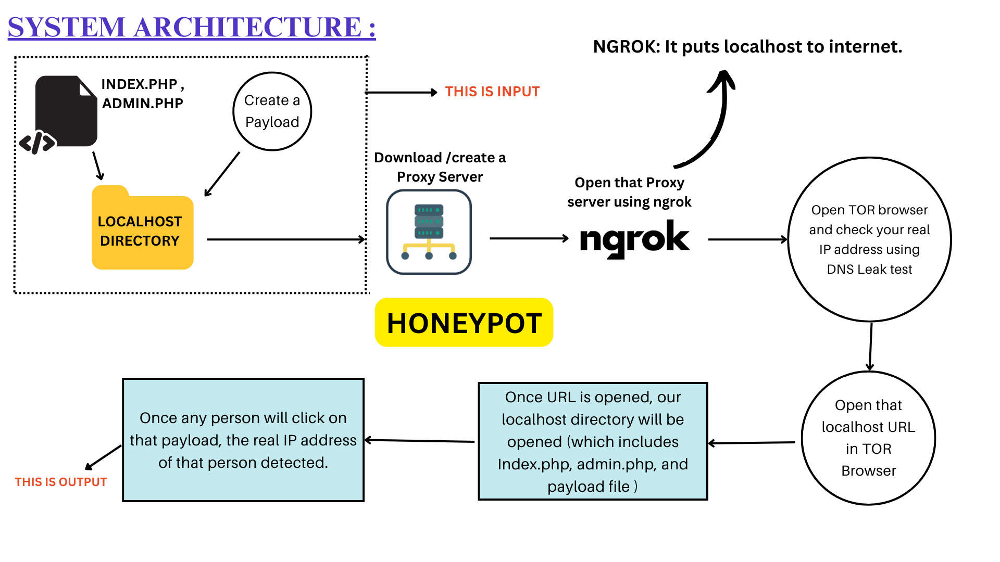
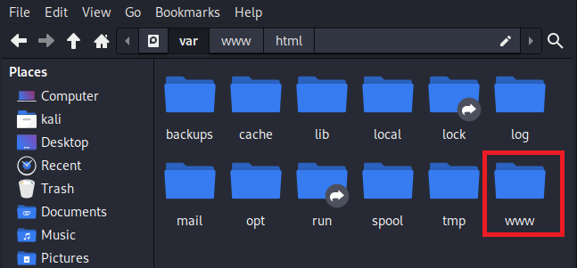
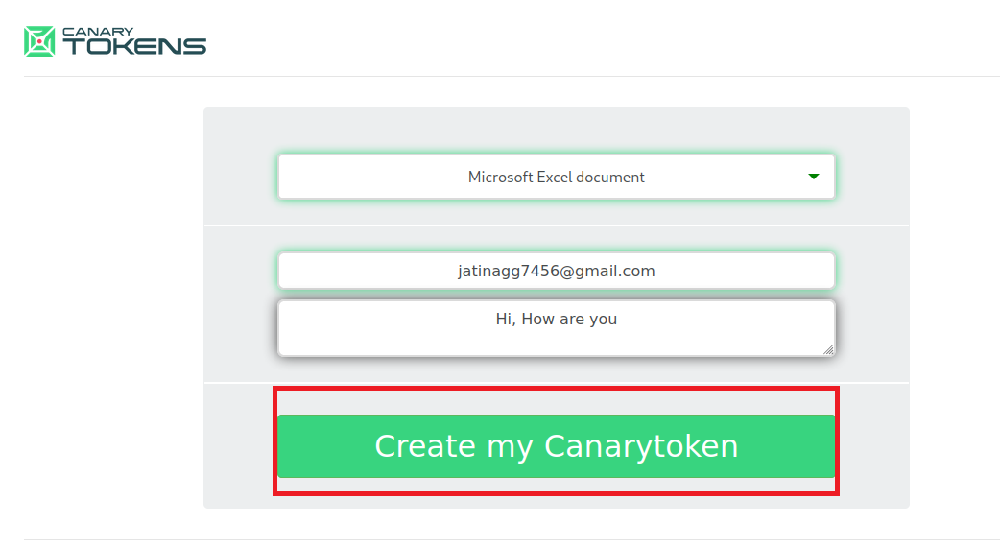
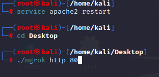
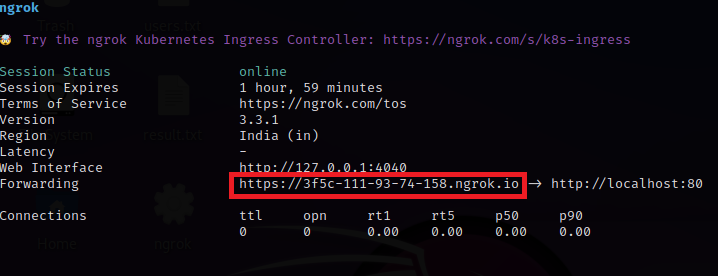
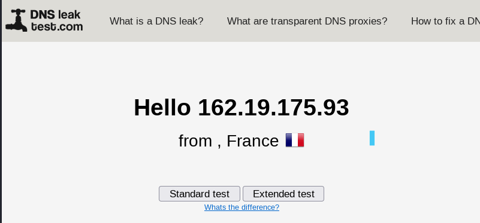
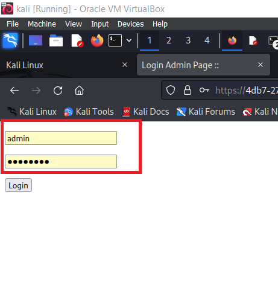
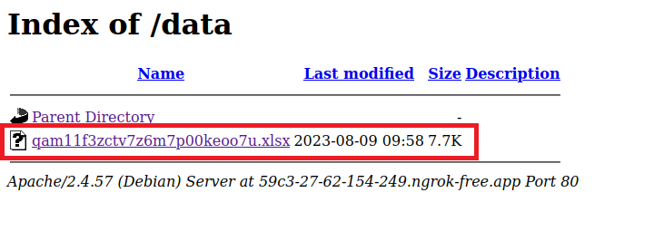
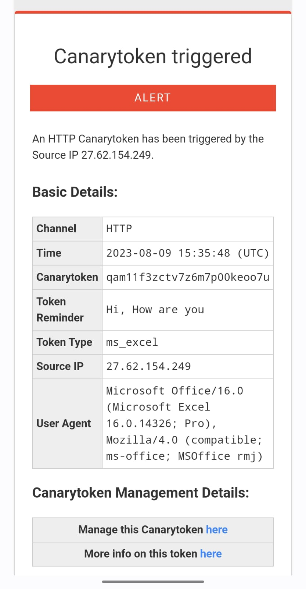
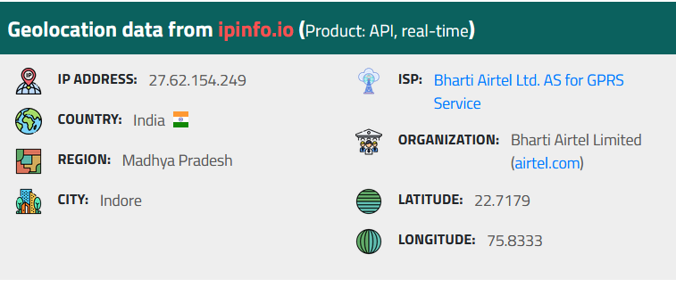

# Tracing Real IP behind VPN/Proxy Server or Tor Browser
Many people use Virtual Private Networks (VPNs) and proxies to keep their online activities private. While these tools offer protection, there are concerns about their potential misuse for illegal activities. Not much research has been done in this area and few studies are available which lack a proper way to trace IP addresses. This research aims to address these concerns by introducing a new method to uncover real IP addresses. Our approach involves using honeypots, which are decoy systems designed to attract attackers. By strategically placing these decoy systems, we can capture the network traffic and behavior of potential threats, helping us reveal their true IP addresses even when they hide behind VPNs. The collected data undergoes advanced analysis, allowing us to identify patterns that may expose the origin of concealed IP addresses. This research contributes to improving online security by providing a practical method to identify and address threats that operate anonymously using VPNs or Proxy Servers. 
# Implementation of Methodology

To trace the actual/real IP address of the unauthorized user who accesses via the VPN server or proxy servers to prevent an attack. As we can see in Fig.4 the proposed work was implemented by employing the subsequent strategy to stop the attack:

1. Platform: Every OS has its own localhost directory. So, our idea is to create a simple login form that has a preset username & password (index.php & admin.php) and paste it into the localhost directory. After that, we will create a payload (which contains the piece of code which will help to detect the Real IP) and paste it also in the localhost directory.

2. Now, the admin page (admin.php) and a straightforward login form (index.php) with a pre-populated username and password. These files should be added to the local host directory.

3. Create a payload that includes code that can identify the user’s actual IP address when they access the login form, the time of access, and the agent of the user. Also stored this payload in the localhost directory. This can be different for different cases usually it is stored in a vulnerable place. The payload is created from Canarytokens. The payload created will be a web image bug that will act as our honey file which when activated sends an alert to the designated email.

  

4. To act as a middleman between the user on the internet and the local server. All communications with the login form will be recorded and kept by the proxy server. To make the local server and proxy server visible to the outside world, use ngrok or localxpose, a program that enables localhost to be accessed from the internet. To access the localhost directory online, Ngrok will offer a special URL.

  
  

5. The attacker will launch the VPN to ensure that it is displaying a false IP address. Tor offers anonymity by channeling internet traffic through a network of volunteer-run servers.

6. Using the Tor browser (Tor makes it difficult to trace the user’s Internet activity) to access the URL provided by ngrok or localxpose, which will cause the login form to load on the local server.

7. When the attacker tries to access or load the honey file it will cause the payload to start looking for information like the real IP address and user agent and send those data back to the server. The intrusion detection or prevention system will take further actions with this information. In short, we can say that once the attacker clicks on that payload, the triggered payload will send us an email.

Using this experiment, we figured out the implementation of the proposed methodology and how the information obtained was used to prevent the attack.
